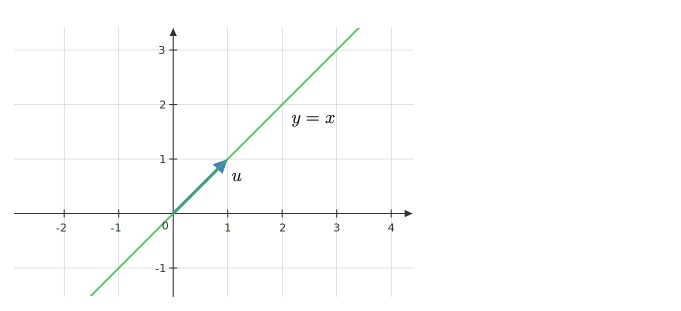
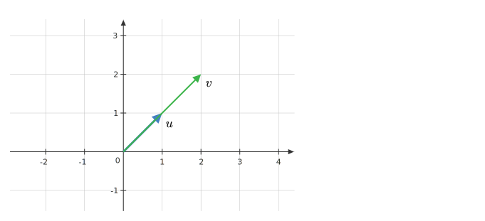
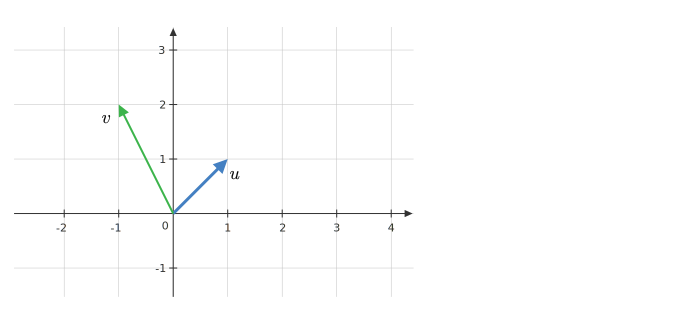
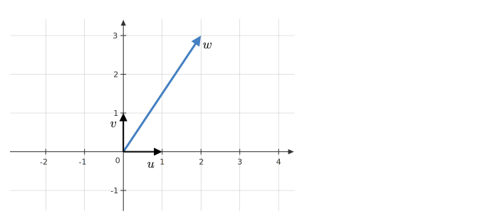

## Vector Spaces

$$
(V, F), (+, .)
$$

::: {.fragment .absolute left="0" top="200"}
$$
\begin{aligned}
& x + (y + z) = (x + y) + z\\\\
& x + y = y + x\\\\
& x + 0 = x\\\\
& x + (-x) = 0
\end{aligned}
$$
:::

::: {.fragment .absolute left="1200" top="200"}
$$
\begin{aligned}
& 1x = x\\\\
& (ab)x = a(bx)\\\\
& (a + b)x = ax + bx\\\\
& a(x + y) = ax + ay
\end{aligned}
$$
:::

## Vector Spaces | Examples

::: {.fragment .absolute left="0" top="100"}

- $\mathbb{R}$
- $\mathbb{R}^2$
- $\mathbb{R}^3$
- $\mathbb{R}^n$
- $\mathbb{R}^{m \times n}$
- All polynomials of degree at most $2$
- All real-valued continuous functions on the interval $[0, 1]$

:::

## Vector Spaces | Examples | Polynomials

::: {.fragment .absolute left="0" top="200"}

- $V$: all polynomials of degree at most $2$
  - $x^2$
  - $x^2 - 3x + 4$
  - $x^3 + x$
  - $x$
  - $0$

:::

::: {.fragment .absolute left="0" top="200"}

- $V$: all polynomials of degree at most $2$
  - $x^2 \in V$
  - $x^2 - 3x + 4 \in V$
  - $x^3 + x \notin V$
  - $x \in V$
  - $0 \in V$

:::

::: {.fragment .absolute left="800" top="200"}

$(p_1x^2 + q_1 x + r_1) + (p_2 x^2 + q_2x + r_2) \\= (p_1 + p_2)x^2 + (q_1 + q_2)x + (r_1 + r_2)$

:::

::: {.fragment .absolute left="800" top="500"}

$c(px^2 + qx + r) = (cp)x^2 + (cq)x + (cr)$

:::

## Subspaces

::: {.fragment .absolute left="0" top="150"}

- Consider $\mathbb{R}^2$
- $U = \{(x, x)\ |\  x,y\in \mathbb{R}\}$
- $U$ is a subspace of $\mathbb{R}^2$
  - $(0, 0) \in U$
  - $(x, x) \in U \text{ and } (y, y) \in U$
    - $(x + y, x + y) \in U$
    - $(cx, cx) \in U$

:::

::: {.fragment}

{.absolute left=600 top=50 width=2000}

:::

## Linear Dependence | Two Vectors | Geometric

:::{.fragment}

{.absolute left=0 top=50 width=2000}

:::

:::{.fragment}

{.absolute left=800 top=50 width=2000}

:::

## Linear Dependence | Two Vectors | Algebraic

Two vectors $u$ and $v$ are linearly dependent if one is a scalar multiple of the other:
$$
u = cv \quad \text{ or } \quad v = cu
$$

:::{.fragment}

{.absolute left=0 top=250 width=2000}

:::

:::{.fragment .absolute left=1200 top=400}
$$
v = 2u
$$
:::

:::{.fragment .absolute left=1100 top=600}
$$
\boxed{2u + (-1) v = 0}
$$
:::

## Linear Dependence | Three vectors

:::{.fragment}

{.absolute left=0 top=100 width=2000}

:::

:::{.fragment .absolute top=200 left=1100}
$$
u = \begin{bmatrix}
1\\
0
\end{bmatrix}, v = \begin{bmatrix}
0\\
1
\end{bmatrix}, w = \begin{bmatrix}
2\\
3
\end{bmatrix}
$$
:::

:::{.fragment .absolute top=400 left=1100}
$$
w = 2u + 3v
$$
:::

:::{.fragment .absolute top=600 left=1100}
$$
\boxed{2u + 3v + (-1) w=0}
$$
:::

## Linear Combination

:::{.fragment .absolute left=0 top=100}

Given vectors $\{v_1, \cdots, v_n\}$ and scalars $c_1, \cdots, c_n$ the following is a linear combination:

:::

:::{.fragment .absolute left=500 top=300}
$$
\large \boxed{c_1 v_1 + \cdots + c_n v_n}
$$
:::

## Linear Dependence | $n$ vectors

:::{.fragment .absolute left=0 top=100}

$S = \{v_1, \cdots, v_n\}$ is linearly dependent if we can find scalars $c_1, \cdots, c_n$ such that:

- $c_1 v_1 + \cdots + c_n v_n = 0$
- $c_i \neq 0$ for at least one $i$

:::

:::{.fragment .absolute left=0 top=400}

If $S$  is linearly dependent with $c_k \neq 0$, then:
$$
v_k = \left(\cfrac{-c_1}{c_k}\right) v_1 + \cdots + \left(\cfrac{-c_{k - 1}}{c_k}\right) v_{k - 1} + \left(\cfrac{-c_{k + 1}}{c_k}\right) v_{k + 1} + \cdots + \left(\cfrac{-c_n}{c_k}\right) v_n
$$

:::

## Linear Dependence | Examples

:::{.fragment .absolute top=200 left=0}
$$
\begin{aligned}
x &= (1, 2, -1, 4)\\\\
y &= (0, 1, 3, 1)\\\\
z &= (1, 3, 2, 5)
\end{aligned}
$$
:::

:::{.fragment .absolute top=200 left=800}
$$
\begin{aligned}
&z = x + y\\\\
& \implies x + y + (-1)z = 0
\end{aligned}
$$
:::

## Linear Independence

:::{.fragment .absolute left=0 top=100}

$S = \{v_1, \cdots, v_n\}$ is linearly independent if it is **not** linearly dependent (OR)

:::

:::{.fragment .absolute left=250 top=300}
$$
\large\boxed{c_1v_1 + \cdots + c_n v_n = 0 \implies c_1 = \cdots = c_n = 0}
$$
:::

## Linear Independence | Examples

:::{.fragment .absolute left=0 top=100}

$S = \{(1,0,0), (0, 1, 0), (0, 0, 1)\}$

:::

:::{.fragment .absolute left=250 top=300}
$$
\begin{aligned}
&c_1(1,0,0) + c_2(0, 1, 0) + c_3(0, 0, 1) = (0, 0, 0)\\\\
\end{aligned}
$$
:::

:::{.fragment .absolute left=250 top=300}
$$
\begin{aligned}
&c_1(1,0,0) + c_2(0, 1, 0) + c_3(0, 0, 1) = (0, 0, 0)\\\\
&(c_1, c_2, c_3) = (0, 0, 0)\\\\
\end{aligned}
$$
:::

:::{.fragment .absolute left=250 top=300}
$$
\begin{aligned}
&c_1(1,0,0) + c_2(0, 1, 0) + c_3(0, 0, 1) = (0, 0, 0)\\\\
&(c_1, c_2, c_3) = (0, 0, 0)\\\\
&\implies c_1 = c_2 = c_3 = 0
\end{aligned}
$$
:::
